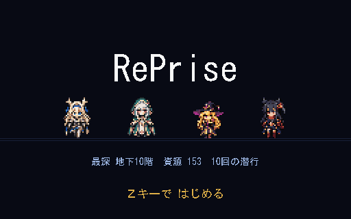
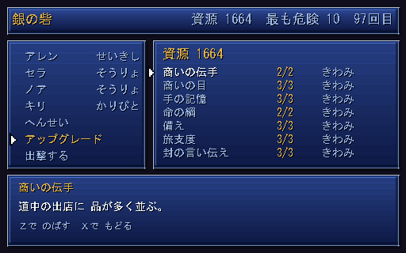

# RePrise

スーパーファミコン期の JRPG の手触りで作る、CTB ローグライク。
レベルも装備もランごとに失うが、職業の熟練度と覚えた技だけは拠点に持ち帰る。






---

## 設計の三本柱

### 1. ジョブ熟練度がメタ進行そのもの

DQ6 の職業、FF5 のジョブ、FF6 の魔石に共通するのは
**「一時的な役割を通じて、恒久的な能力を得る」** という構造で、これはローグライクの
メタ進行と同型である。だから追加の発明をせずに両者が噛み合う。

| ランで失う | 拠点に残る |
|---|---|
| レベル / HP / MP / 所持金 | 職業熟練度 → 習得アビリティ |
| その場のジョブ編成 | 解放された職業 |

境界は `src/game/game_state.gd` の `end_run()` 一か所に集約してある。
ここが散らばるとローグライクは必ず壊れる。

そしてこの境界は**見えていなければ手応えにならない**ので、ラン終了後は必ず拠点
「銀の砦」に戻す。レベルが 1 に戻ったことと、熟練度が 96/160 まで積み上がったことを
同じ画面に並べる。転職もここだけで行い、潜行中は禁じてある（`change_job()` が
`run_active` を見る）。ラン中に職業を変えられると、レベルを失うという代償に
抜け道ができてしまう。

### 2. CTB は「戦闘の仕組み」ではなく「共通スケジューラ」

CTB（カウントタイムバトル）は、伝統的ローグライクのエナジー系スケジューラと
数学的に同じもので、どちらも **仮想時間軸上の優先度キュー** に還元される。
そのため探索の歩行ターンと戦闘の行動順を 1 本のコードで回せる（ATB では必ず二重実装になる）。

演算は整数のみ。実時間にも浮動小数にも依存しないので、同じ入力からは必ず同じ行動順が出る。

副産物として **行動コストが MP に次ぐ第 2 のリソース軸**になる。数値を膨らませずに
職業ごとの「テンポの個性」を作れる。

| 職業 | コスト倍率 | 性格 |
|---|---|---|
| とうぞく | 70 | 手数で押す |
| にんじゃ | 80 | 速さのまま魔を使う（上級） |
| そうりょ | 90 | 軽い補助を高回転で |
| せいきし | 120 | 護りと癒しを兼ねる（上級） |
| せんし | 130 | 重い一撃、次の手番が遅れる |
| まほうつかい | 145 | 詠唱ぶん重い |

上級職は**その本人**が基本職 2 つで熟練 ★2 に届くと解放される。
誰かが極めたから全員が就ける、にはしない。そうすると 1 人を育てるだけで済み、
4 人それぞれの経歴という手応えが消える。

行動順バーに次の 10 手を常時表示し、技の一覧にも「つぎのてばんまで」の実数を出す。
ATB の緊張感の正体は「時間」ではなく「順番の奪い合い」なので、
順番を見せてしまえばターン制のまま同じ駆け引きが成立する。

戦闘の中身（属性・状態異常・範囲攻撃・敵の予告・盗む）は、往年の JRPG を
調べたうえで決めている。根拠は **[docs/battle_design.md](docs/battle_design.md)**。
要点だけ言うと、

- **属性は 4 つ**（炎・氷・雷・闇）。敵ごとに効く手が変わらないと、
  最強の 1 手を覚えた時点で考えるのをやめてしまう
- **状態異常は時間に効くものを優先**（ねむり・どんそく・どく）。CTB では
  行動順そのものが歪むので、他の作品より効き目が目に見える
- **範囲攻撃は数が少ないほど 1 体あたりが増える**。減衰が無いと範囲が常に最適になる
- **敵の次の手を予告する**。行動順バーに出すだけでよく、相手を見て手を変える理由になる

コマンドは 2 階層（たたかう / じゅもん / とくぎ / どうぐ / ぼうぎょ / にげる / オート）。
技のコストは「つぎのてばんまで」という見出しで常に出す。CTB では
それが選択の核心なので隠さない。

### 3. 決定性は機能ではなく前提

シードが同じなら、地形・敵編成・ダメージ・行動順のすべてが一致する。
これが崩れるとリプレイも不具合の再現もバランスの自動調整も同時に失われる。

- 乱数は `DetRng`（xoshiro128\*\*、全演算 32bit マスク）のみ。エンジンの乱数は使わない
- 系統ごとに `fork()` する。地形生成で乱数を余分に引いても宝や敵はずれない
- 同時刻の行動順は id 昇順で確定させる（配列順という偶然に依存しない）

`tests/test_core.gd` が 30 項目でこれを検査する。特に重要なのは次の 2 つ。

- **先読みが実際の行動順と一致する** — 行動順バーが嘘をつかないことの保証
- **39 シードすべてで階段に到達できる** — 詰みフロアを出さないことの保証

---

## ローカル AI の方針

**ゲームロジックには一切入れない。** LLM は非決定的で遅延も出力も保証されないため、
上記の決定性と根本的に噛み合わない。層をきっぱり分ける。

```
[ゲームロジック層]  seed → PRNG → 生成・戦闘・ドロップ   ← LLM 禁止・完全決定的
        ↓ 構造化された事実（誰が / 何を / どうした）
[テキスト層]        LLM は「言葉」だけを担当             ← 失敗してもゲームは進む
```

接続点は `src/game/chronicle.gd` ただ 1 か所。ラン終了画面は
「もう操作するものが無い」唯一の画面なので、数秒の生成待ちが許される。
現状は決定的なテンプレート出力で、これがそのまま LLM 版のフォールバックになる。

`facts_for_llm()` が渡すのは事実の構造だけで、文章の指示はプロンプト側に置く。

将来のもう一つの本命は**オーサリング時の生成**。ジョブ × アビリティは組み合わせが
爆発するので、説明文を 27B クラスでオフライン生成し JSON へ焼く。
ランタイムの不確実性がゼロのまま、テキスト量だけが増える。

---

## SFC らしさを支える規約

見た目と音は「守れる仕組み」として実装してある。感覚ではなく制約で寄せる。

### アート（`tools/sfc_art.py`）

- 色は **BGR555**（各チャンネル 5bit）へ量子化される。実機と同じ色数制約
- 1 サブパレットは **15 色 + 透明**。超えると生成時に落ちる
- ドット絵は **ASCII マップ + 凡例**で記述する。差分がレビューできる
- 左右対称のものは半身だけ描いて鏡像で綴じる
- 階調は半透明ではなく **4x4 Bayer ディザ**で作る

キャラは **24x32**（FF6 / クロノ級）、タイルは 16px。標準の 256x224 に 16x16 キャラを
置くと、寸法がそのままファミコンの規格になりどう描いてもあの粗さになる。

解像度は **512x320**。はじめは 384x240（後期 SFC 相当）だったが、日本語を並べたときに
破綻した。MS ゴシックの漢字は **13px を下回ると画数が潰れて読めない**（銀・響・深・階が
団子になる）。384 幅では、読める大きさの文字を並べると 1 行に入る字数が足りない。
文字を優先して 4/3 倍に上げてある。キャラとタイルの寸法は据え置きなので絵はそのまま使える。

そのぶん UI には規約を 2 つ置いた（`src/ui/pixel_ui.gd`）。

- **漢字を出してよいのは 14px 以上**（`SIZE_TEXT`）。12px（`SIZE_SUB`）は かな・数字専用
- **文字の座標は左上で指定する**。`draw_string` はベースライン基準なので、
  そのまま渡すと窓枠に文字がめり込む（実際にそうなっていた）

### キャラクターの描き分け（`tools/gen_assets.py`）

24x32 で人の顔に見せる要点は、目を**縦に**大きく取ること。細い目は必ず不気味に見える。
目は 2px 幅 x 3 段（睫毛 / 白目＋虹彩 / 虹彩の影）で、まわりに肌を残す。
前髪と目のあいだに額を 1 段入れる。口は描かない（この寸法では点にしかならず、
点は表情ではなく汚れに見える）。

職業ごとの差は**差し色ではなくシルエット**で作る。色だけ変えても同じ人に見えるため、
基本の姿に差分（`HERO_LOOKS`）を重ねて被り物・髪の長さ・肩の厚み・裾の広がりを変える。

**色は面積で効かせる。** 胸の 1px の線をいくら変えても、遠目には同じ人に見える。
DQ が少ないドットで人を見分けられるのは、髪のシルエットと「体のどこが何色か」が
人ごとに違うからで、差し色の有無ではない。

| | 頭 | 髪 | 面積の大きい色 |
|---|---|---|---|
| せんし | 金の額当て | 肩で切りそろえ | 蒼のマントが体の左右 |
| そうりょ | 白いベール（頭が白い塊） | 長い | 翠の帯が胸から裾へ |
| まほうつかい | つば広の帽子（最も横に広い） | 長い | 桃のローブが胴全面 |
| とうぞく | 紅のフード | ツインテール（最も外へ張り出す） | 紅 |
| せいきし | 翼付きの額当て | 長い | 金の縁取りの白いマント |
| にんじゃ | 額当て + 口元の面 | 右へ流した束ね髪 | 紫の帯 |

### 音（`tools/sfc_audio.py`）

SFC の音が独特だった理由を明示的に再現する。

1. **32kHz** 出力。高域が素直に伸びない
2. **一次ローパス** — SPC700 のガウス補間が作っていた「丸み」の代用。
   これを外すと途端にファミコン風の刺さる音になる
3. **DSP 内蔵エコー** — 左右で遅延長を変えたフィードバック付きコムフィルタ。
   これが無いと音色をいくら似せても SFC には聞こえない

BGM は既存曲の複製ではなく、同じ書法で書いたオリジナル。

| 曲 | 調性 | 狙い |
|---|---|---|
| `stronghold` | 長調・堂々とした歩調 | 古典的な和声を素直に辿る、王宮的な品 |
| `descent` | 短調・i-♭VI-♭VII-i | 低音が八分で刻み続ける「進軍」の響き |
| `battle` | 短調・速い 8 小節 | 短く回る戦闘曲 |

`tools/verify_audio.py` が無音・クリップ・直流成分・音程を機械的に検算する
（耳で確認できない環境でも壊れを検出できる）。

---

## 構成

```
assets/          生成されたドット絵と音（音は .gitignore、下記参照）
data/            ジョブ・アビリティ・モンスターの定義（JSON）
docs/chara_image/ キャラクター設定画（白銀の髪 + 黒基調 + 差し色 1 色）
src/
  core/          DetRng / CtbScheduler / Battler   ← 決定性の心臓部
  dungeon/       シード付きフロア生成
  battle/        戦闘ロジック（描画も入力も持たない）
  game/          ラン管理・メタ進行・戦記
  ui/            ドット絵向けの UI 部品と用語表（terms.gd）
  scenes/        拠点 / 探索 / 戦闘 / 結果の各画面
tests/           決定性テスト
tools/           アセット生成器（これが原本）
```

---

## 動かす

```bash
python tools/gen_assets.py     # ドット絵を生成
python tools/gen_audio.py      # 音を生成（数秒）
godot --headless --import      # class_name をエンジンに登録
godot --path .                 # 起動
```

操作は方向キー（`WASD` も可）/ `Z` 決定 / `X` キャンセル。
探索中に `Z` でメニュー（どうぐ / つよさ / そうび）が開く。

```bash
godot --headless --script res://tests/test_core.gd   # 決定性テスト
python tools/verify_audio.py                          # 音の検算
godot --path . -- --shot=battle                       # 画面を 1 枚撮って終了
```

音声 WAV だけは合計 11MB あるため追跡していない。生成器が原本なので
`gen_audio.py` を実行すれば再現できる。ドット絵は数 KB なので追跡している
（差分がレビューできる利点が勝る）。音が無くてもゲームは完全に動作する。

---

## 書き出す（ビルド）

配布用の実行ファイルを作る。Godot 本体とは別に**エクスポートテンプレート**が要る。

### 1. テンプレートを入れる（初回だけ）

テンプレートは**エンジンと同じバージョンでなければならない**（4.7.1 のエンジンは
`4.7.1.stable` のテンプレートしか使わない）。エディタの
`エディター > エクスポートテンプレートの管理 > ダウンロードしてインストール` が最短。

CLI だけで済ませるなら、公式リリースの `.tpz`（実体は zip）を展開して置く。

```powershell
$ver = "4.7.1-stable"
curl.exe -L -o templates.zip `
  "https://github.com/godotengine/godot/releases/download/$ver/Godot_v${ver}_export_templates.tpz"
# .tpz の中身はただの zip。ただし Expand-Archive は拡張子で弾くので .zip で受ける
Expand-Archive templates.zip -DestinationPath tpz
# 中身は templates/ 直下。これを <バージョン>.stable/ という名前で置く
Move-Item tpz\templates "$env:APPDATA\Godot\export_templates\4.7.1.stable"
```

ダウンロードは 1.3GB ある（全プラットフォーム分がまとまっているため）。
入ったかは `%APPDATA%\Godot\export_templates\4.7.1.stable\windows_release_x86_64.exe`
の有無で分かる（Linux / macOS は `~/.local/share/godot/export_templates/`）。

### 2. 書き出す

```bash
python tools/gen_assets.py    # 先に生成しておく。特に音は追跡していないので
python tools/gen_audio.py     # これを飛ばすと「音の無いビルド」ができあがる
godot --headless --import     # class_name と .import を最新にする

mkdir -p build/windows        # 出力先が無いと Godot は作らずに失敗する
godot --headless --export-release "Windows Desktop" build/windows/RePrise.exe
```

PowerShell の `mkdir` に `-p` は無い。`New-Item -ItemType Directory -Force build\windows`。

出力は `build/windows/` に `RePrise.exe`（約 104MB）と `RePrise.pck`（約 2.5MB）の 2 つ。
`build/` は追跡しない。配布するときは両方を同じ階層に置く。1 ファイルにまとめたい場合は
`export_presets.cfg` の `binary_format/embed_pck` を `true` にする。

`docs/`・`tools/`・`tests/` はプリセットの `exclude_filter` で除いてある。
ドット絵の原本（Python）や撮影物まで配布物に入れる必要は無い。

`--export-release` を `--export-debug` に替えるとデバッグビルドになる。
アサートとエラー表示が残るので、配る前の確認はこちらで踏む。標準出力を目で見たいなら
プリセットの `debug/export_console_wrapper` を `1` にすると
コンソール付きの `RePrise.console.exe` が一緒に出る。

プリセット（`export_presets.cfg`）は**リポジトリに入れてある**。Godot が普段は
無視するファイルだが、追跡しないと上のコマンドがそのままでは動かないため。
鍵や署名のパスワードは書かないこと。

### バージョン番号

原本は `project.godot` の `application/config/version` の 1 か所だけ。

- ウィンドウのタイトルバーに `RePrise  v0.1.0` と出る（`src/game/version.gd`）
- 書き出した `.exe` のファイルプロパティも `0.1.0.0` になる
  （プリセットのバージョン欄を空にしてあるので、Godot が上記を拾う）

ソースから起動したビルドだけ `v0.1.0-dev` と出る（デバッグ実行ではさらに
エンジンが ` (DEBUG)` を足す）。手元で動かしているものと配った実行ファイルを、
報告を受けた時に取り違えないため。上げるときは `config/version` を書き換えるだけでよい。

---

## 現状と次の一手

動くもの: 拠点 → 出撃 → 探索 → 遭遇 → CTB 戦闘 → 出店 → 地下 10 階の主 →
生還 or 全滅 → 戦記 → 拠点。**始まりと終わりのある輪**として閉じている。

- **終わりがある** — 地下 10 階には下り階段が無く、主の間の扉だけがある。
  主を倒すと「生還」でランが終わる（`end_run(true)` へ至る唯一の経路）
- **ゴールドはラン内資源** — 道中の出店で消耗品と休息に換える。持ち帰れない。
  買い物を拠点ではなく道中に置いたのは、「今使うか、取っておくか」を
  潜っている最中に判断させたいから。拠点に置くと計画の問題になってしまう
- **道具も手番を消費する** — 回復に 1 手番を割く、という CTB 上の判断が成立する

### 二層の通貨

ランで使う資源と、ランをまたいで積む資源を**別の通貨に分けてある**。
1 本にすると「今飲むか、将来のために貯めるか」を毎回比べさせることになり、
道中の緊張と拠点の計画が同じ軸で潰し合う。

| | 得かた | 使いみち | ランをまたぐか |
|---|---|---|---|
| **ゴールド** | 戦闘・宝箱・ぬすむ | 道中の出店（消耗品・休息） | 失う |
| **残響** | 毎ラン、道中スコアに応じて必ず | 拠点のアップグレード | 残る |

残響は**最深階の更新やボス撃破のような一度きりの達成には紐付けない**。
達成したあとのランで前進が止まり、周回する理由が消えるため。
「今回どれだけやれたか」（到達階 × 撃破数 × 稼ぎ、生還なら加点）に対して毎回払う。
全滅したランにも必ず入る。

スコアが見るのは所持金ではなく**稼いだ累計**。所持金で測ると出店で使うほど
恒久報酬が減り、買わずに抱えるのが最適解になってしまう。

アップグレードは能力値には触れない（旅支度・手の記憶・商いの伝手・備え）。
レベルを失うことがランの代償なので、そこを恒久強化で埋めると代償そのものが消える。
手に入るのは「立ち上がりの楽さ」だけ。

### 数値は測って決める

戦闘が描画も入力も持たないので、**ランを最後まで自動で回せる**。

```bash
godot --headless --script res://tests/balance.gd
```

200 ラン走らせて到達階の分布と勝率を出す。現状は次の帯に合わせてある。

```
主に挑めた   : 72 / 200 (36%)
主を倒した   : 45 / 200 (22%)
平均レベル   : 8.8
```

自動操縦は道具も出店も使わないので、この数字は**人が操作したときの下限**。
経験値曲線・敵の能力・階層補正を触ったら必ず測り直す。最初の測定では
**200 ラン全部が主に届かず全滅**しており、勘で置いた数値がどれだけ外れるかが
そのまま出た（`8L²+12L` の経験値曲線と 10%/階の補正が二重に効いていた）。

次に効く順:

1. **控えメンバーと編成** — 名簿は 4 人固定。増えれば拠点の「出撃する」が選択になる
2. **戦記のローカル AI 化** — `chronicle.gd` を Ollama に繋ぐ。接続点は 1 か所に絞ってある
3. **状態異常** — 毒・眠りなど、CTB の行動順に効く効果をもう一段
4. **キャッチコピー** — タイトル画面はジャンル表記だけにしてある
