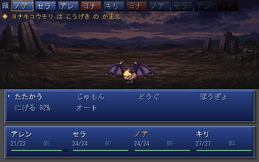
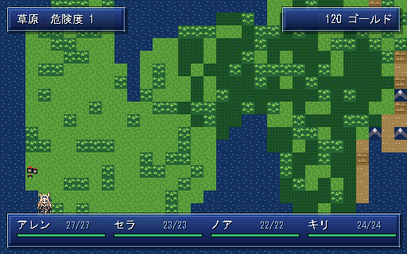
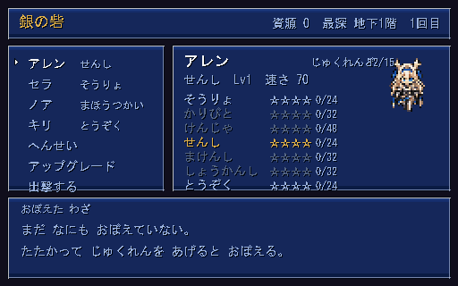
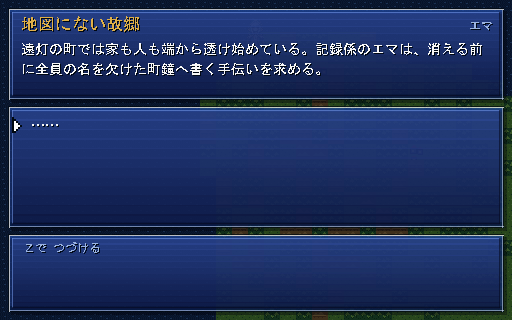

# RePrise

スーパーファミコン期の JRPG の手触りで作る、CTB ローグライク。
レベルも装備もランごとに失うが、職業の熟練度と覚えた技だけは拠点に持ち帰る。






---

## 設計の三本柱

### 1. ジョブ熟練度がメタ進行そのもの

DQ6 の職業、FF5 のジョブ、FF6 の魔石に共通するのは
**「一時的な役割を通じて、恒久的な能力を得る」** という構造で、これはローグライクの
メタ進行と同型である。だから追加の発明をせずに両者が噛み合う。

| ランで失う | 拠点に残る |
|---|---|
| レベル / HP / MP / 所持金 | 職業熟練度 → 習得アビリティ |
| その場のジョブ編成 | 解放された職業 |

境界は `src/game/game_state.gd` の `end_run()` 一か所に集約してある。
ここが散らばるとローグライクは必ず壊れる。

そしてこの境界は**見えていなければ手応えにならない**ので、ラン終了後は必ず拠点
「銀の砦」に戻す。レベルが 1 に戻ったことと、熟練度が 96/160 まで積み上がったことを
同じ画面に並べる。転職もここだけで行い、潜行中は禁じてある（`change_job()` が
`run_active` を見る）。ラン中に職業を変えられると、レベルを失うという代償に
抜け道ができてしまう。

### 2. CTB は「戦闘の仕組み」ではなく「共通スケジューラ」

CTB（カウントタイムバトル）は、伝統的ローグライクのエナジー系スケジューラと
数学的に同じもので、どちらも **仮想時間軸上の優先度キュー** に還元される。
そのため探索の歩行ターンと戦闘の行動順を 1 本のコードで回せる（ATB では必ず二重実装になる）。

演算は整数のみ。実時間にも浮動小数にも依存しないので、同じ入力からは必ず同じ行動順が出る。

副産物として **行動コストが MP に次ぐ第 2 のリソース軸**になる。数値を膨らませずに
職業ごとの「テンポの個性」を作れる。

| 職業 | コスト倍率 | 性格 |
|---|---|---|
| とうぞく | 70 | 手数で押す |
| そうりょ | 90 | 軽い補助を高回転で |
| せんし | 130 | 重い一撃、次の手番が遅れる |
| まほうつかい | 145 | 詠唱ぶん重い |

行動順バーに次の 10 手を常時表示し、コマンドにも `待70` のように実コストを出す。
ATB の緊張感の正体は「時間」ではなく「順番の奪い合い」なので、
順番を見せてしまえばターン制のまま同じ駆け引きが成立する。

### 3. 決定性は機能ではなく前提

シードが同じなら、地形・敵編成・ダメージ・行動順のすべてが一致する。
これが崩れるとリプレイも不具合の再現もバランスの自動調整も同時に失われる。

- 乱数は `DetRng`（xoshiro128\*\*、全演算 32bit マスク）のみ。エンジンの乱数は使わない
- 系統ごとに `fork()` する。地形生成で乱数を余分に引いても宝や敵はずれない
- 同時刻の行動順は id 昇順で確定させる（配列順という偶然に依存しない）

`tests/test_core.gd` が 30 項目でこれを検査する。特に重要なのは次の 2 つ。

- **先読みが実際の行動順と一致する** — 行動順バーが嘘をつかないことの保証
- **39 シードすべてで階段に到達できる** — 詰みフロアを出さないことの保証

---

## ローカル AI の方針

**ゲームロジックには一切入れない。** LLM は非決定的で遅延も出力も保証されないため、
上記の決定性と根本的に噛み合わない。層をきっぱり分ける。

```
[ゲームロジック層]  seed → PRNG → 生成・戦闘・ドロップ   ← LLM 禁止・完全決定的
        ↓ 構造化された事実（誰が / 何を / どうした）
[テキスト層]        LLM は「言葉」だけを担当             ← 失敗してもゲームは進む
```

接続点は `src/game/chronicle.gd` ただ 1 か所。ラン終了画面は
「もう操作するものが無い」唯一の画面なので、数秒の生成待ちが許される。
現状は決定的なテンプレート出力で、これがそのまま LLM 版のフォールバックになる。

`facts_for_llm()` が渡すのは事実の構造だけで、文章の指示はプロンプト側に置く。

将来のもう一つの本命は**オーサリング時の生成**。ジョブ × アビリティは組み合わせが
爆発するので、説明文を 27B クラスでオフライン生成し JSON へ焼く。
ランタイムの不確実性がゼロのまま、テキスト量だけが増える。

---

## SFC らしさを支える規約

見た目と音は「守れる仕組み」として実装してある。感覚ではなく制約で寄せる。

### アート（`tools/sfc_art.py`）

- 色は **BGR555**（各チャンネル 5bit）へ量子化される。実機と同じ色数制約
- 1 サブパレットは **15 色 + 透明**。超えると生成時に落ちる
- ドット絵は **ASCII マップ + 凡例**で記述する。差分がレビューできる
- 左右対称のものは半身だけ描いて鏡像で綴じる
- 階調は半透明ではなく **4x4 Bayer ディザ**で作る

解像度は **384x240（後期 SFC 相当）**、キャラは **24x32**（FF6 / クロノ級）。
標準の 256x224 に 16x16 キャラを置くと、寸法がそのままファミコンの規格になり
どう描いてもあの粗さになる。

### 音（`tools/sfc_audio.py`）

SFC の音が独特だった理由を明示的に再現する。

1. **32kHz** 出力。高域が素直に伸びない
2. **一次ローパス** — SPC700 のガウス補間が作っていた「丸み」の代用。
   これを外すと途端にファミコン風の刺さる音になる
3. **DSP 内蔵エコー** — 左右で遅延長を変えたフィードバック付きコムフィルタ。
   これが無いと音色をいくら似せても SFC には聞こえない

BGM は既存曲の複製ではなく、同じ書法で書いたオリジナル。

| 曲 | 調性 | 狙い |
|---|---|---|
| `stronghold` | 長調・堂々とした歩調 | 古典的な和声を素直に辿る、王宮的な品 |
| `descent` | 短調・i-♭VI-♭VII-i | 低音が八分で刻み続ける「進軍」の響き |
| `battle` | 短調・速い 8 小節 | 短く回る戦闘曲 |

`tools/verify_audio.py` が無音・クリップ・直流成分・音程を機械的に検算する
（耳で確認できない環境でも壊れを検出できる）。

---

## 構成

```
assets/          生成されたドット絵と音（音は .gitignore、下記参照）
data/            ジョブ・アビリティ・モンスターの定義（JSON）
docs/chara_image/ キャラクター設定画（白銀の髪 + 黒基調 + 差し色 1 色）
src/
  core/          DetRng / CtbScheduler / Battler   ← 決定性の心臓部
  dungeon/       シード付きフロア生成
  battle/        戦闘ロジック（描画も入力も持たない）
  game/          ラン管理・メタ進行・戦記
  ui/            ドット絵向けの UI 部品
  scenes/        拠点 / 探索 / 戦闘 / 結果の各画面
tests/           決定性テスト
tools/           アセット生成器（これが原本）
```

---

## 動かす

```bash
python tools/gen_assets.py     # ドット絵を生成
python tools/gen_audio.py      # 音を生成（数秒）
godot --headless --import      # class_name をエンジンに登録
godot --path .                 # 起動
```

操作は方向キー / `Z` 決定 / `X` キャンセル。

```bash
godot --headless --script res://tests/test_core.gd   # 決定性テスト
python tools/verify_audio.py                          # 音の検算
godot --path . -- --shot=battle                       # 画面を 1 枚撮って終了
```

音声 WAV だけは合計 11MB あるため追跡していない。生成器が原本なので
`gen_audio.py` を実行すれば再現できる。ドット絵は数 KB なので追跡している
（差分がレビューできる利点が勝る）。音が無くてもゲームは完全に動作する。

---

## 現状と次の一手

動くもの: 拠点 → 出撃 → 探索 → 遭遇 → CTB 戦闘 → 出店 → 地下 10 階の主 →
生還 or 全滅 → 戦記 → 拠点。**始まりと終わりのある輪**として閉じている。

- **終わりがある** — 地下 10 階には下り階段が無く、主の間の扉だけがある。
  主を倒すと「生還」でランが終わる（`end_run(true)` へ至る唯一の経路）
- **ゴールドはラン内資源** — 道中の出店で消耗品と休息に換える。持ち帰れない。
  買い物を拠点ではなく道中に置いたのは、「今使うか、取っておくか」を
  潜っている最中に判断させたいから。拠点に置くと計画の問題になってしまう
- **道具も手番を消費する** — 回復に 1 手番を割く、という CTB 上の判断が成立する

次に効く順:

1. **恒久通貨** — 毎ランの道中スコアに応じて必ず支払い、アップグレードに使わせる。
   一度きりの達成報酬にすると周回の動機が切れる
2. **上級職の解放** — 「せんし ★3 + そうりょ ★3 → ○○」。熟練を貯める動機が
   ラン単位からゲーム単位に伸びる
3. **バランス調整** — 戦闘は描画も入力も持たないので、ヘッドレスで数千回回して
   勝率を測れる。この土台はすでにある
4. **アビリティの効果拡張** — かばう（今は対象に防御を立てるだけで攻撃を引き受けていない）、
   バフの継続ターン管理
5. **戦記のローカル AI 化** — `chronicle.gd` を Ollama に繋ぐ。接続点は 1 か所に絞ってある
